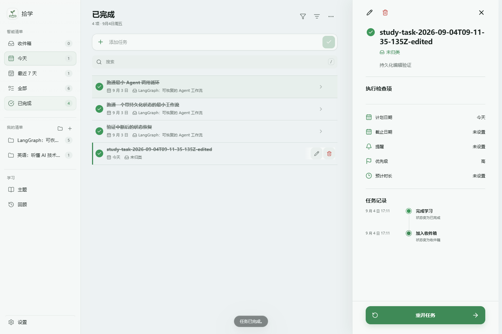
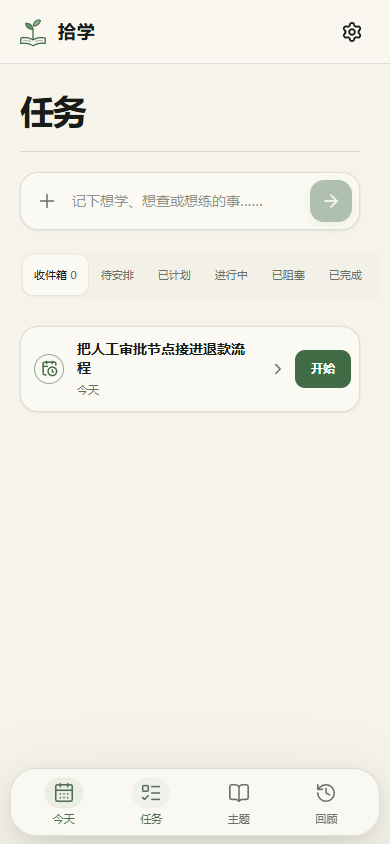

<p align="center">
  
</p>

<h1 align="center">拾学</h1>

<p align="center">
  <strong>把想学会的事，变成每天能完成、能证明、会复习的一小步。</strong><br />
  面向 Windows 的本地优先个人学习记录助手。
</p>

<p align="center">
  <a href="./README.en.md">English</a>
  ·
  <a href="https://github.com/Shiaoming123/shixue/releases/latest">下载最新版</a>
  ·
  <a href="./docs/README.md">项目文档</a>
</p>

> **脚手架来源**：拾学基于开源项目 [MeowStarter](https://github.com/Shiaoming123/meow-starter) 构建。它提供 Tauri 2、Vue 3、本地存储、多端能力边界和发布工具；拾学在此基础上实现学习任务领域、完整产品链路与独立视觉系统。



## 产品定位

普通待办应用擅长提醒“要做什么”，但学习还需要回答：怎样才算学会、留下了什么证据、什么时候应该回来复习。

拾学把任务管理与学习记录放在同一条闭环中：

`快速记录 → 整理任务 → 安排学习 → 专注执行 → 证据式完成 → 1 / 3 / 7 天复习`

它适合希望在一台 Windows 电脑上管理个人学习、又不想先注册账号或把学习记录上传到云端的人。当前版本是单人、本地、桌面优先的产品，不是团队协作、AI 自动规划或通用项目管理工具。

## 界面

界面采用暖纸色、深墨色和低饱和鼠尾草绿，并用系统字体、圆角分组、半透明材质、底部 Sheet 与克制动效建立接近 iOS 的交互质感。Windows 桌面端保留高信息密度，390px 移动宽度则使用全屏详情和四项底部导航。

| Windows 桌面任务中心 | 390px 移动布局 |
| --- | --- |
| [](./docs/design/shixue-tasks-desktop-implementation.png) | [](./docs/design/shixue-tasks-mobile-implementation.png) |

设计稿、实现截图和偏差说明见 [视觉保真记录](./docs/design/fidelity-ledger.md)。

## 学习任务闭环

- **今天**：跨主题汇总今日队列；活动任务固定在首位，逾期任务由用户决定放到今天、延期或取消。
- **任务**：收件箱只需标题即可保存；整理时补充主题、计划日期、截止日期、预计时长、完成标准和执行检查项。
- **专注**：一次只运行或暂停一个学习会话。切换任务会暂停当前会话，计时和随手记可以在重启后恢复。
- **可追溯状态**：开始、暂停、继续、阻塞、延期、完成、取消和重开都会形成高价值事件时间线。
- **证据式完成**：学习收获、成果证据和下一步均为必填项；结束一次专注不会自动完成整个任务。
- **主题**：围绕目标和成功标准组织任务，不再维护与任务重复的步骤数据。
- **回顾**：按 1 / 3 / 7 天安排复习；完成记录支持搜索、主题筛选，并可从“下一步”显式创建新任务。
- **本地数据演进**：WorkspaceState v3 支持 Study v1/v2 迁移与导入；IndexedDB / SQLite 在迁移前保留旧快照，新导出使用 `meow-study/workspace-export` v3。旧版本应用不能读取 v3 数据，升级前备份不包含升级后的新增记录，也不提供自动降级恢复。

## Windows 下载

前往 [GitHub 最新 Release](https://github.com/Shiaoming123/shixue/releases/latest)。下载页始终指向当前最新版，不需要在 README 中追踪版本号。

| 选择 | Release 资产名称 | 适用场景 |
| --- | --- | --- |
| **免安装版（优先）** | `Shixue_*_x64_Portable.exe` | 直接运行，不写入 Windows 安装记录。若当前 Release 未附此资产，请使用 Setup 安装版。 |
| **安装版** | `Shixue_*_x64-setup.exe` | 当前用户安装，适合日常长期使用。 |
| **MSI** | `Shixue_*_x64.msi` | 适合需要 Windows Installer 的部署环境。 |

使用前请了解三个边界：

1. Portable 指“应用程序本体免安装”，不代表数据随 EXE 移动。任务数据库和偏好仍保存在 Windows 的 AppData 应用数据目录中。
2. 应用依赖 Microsoft Edge WebView2 Runtime。Windows 10/11 通常已经提供；缺失时请从 [Microsoft WebView2 官方页面](https://developer.microsoft.com/microsoft-edge/webview2/) 安装。
3. 当前 Windows 包没有 Authenticode 代码签名，SmartScreen 可能显示“未知发布者”。请只从本仓库 Release 下载，并在需要时核对 Release 或本地交付包提供的 SHA-256 信息。

完整的本地 Windows 交付包还可以包含 Portable、NSIS、MSI、`SHA256SUMS.txt`、`manifest.json` 和交付说明；构建与审计方法见 [Release Kit](./docs/release-kit.md)。

## 从源码运行

### Web 开发模式

需要 Node.js 22+：

```bash
npm ci
npm run dev:web
```

### Windows 桌面开发

除 Node.js 外，还需要 Rust 1.77.2+ 和 [Tauri 的 Windows 前置依赖](https://tauri.app/start/prerequisites/)：

```bash
npm ci
npm run doctor
npm run tauri dev
```

### 构建完整 Windows 本地交付包

```bash
npm run release:check
npm run verify
npm run rust:verify
npm run package:windows
npm run smoke:windows-package
```

输出位于 `release-artifacts/windows/<version>/`。该目录是构建产物，不纳入源码版本控制。

## 数据与隐私

- Windows 桌面端使用 SQLite；Web 端使用当前站点来源下的 IndexedDB。
- 学习数据默认不需要账号，也不会作为同步数据上传。应用检查更新时可能访问 GitHub Releases。
- JSON 导出用于备份或在 Web/桌面运行时之间手动迁移；两端不会自动互相同步。
- 取消任务不会物理删除任务、会话、事件或完成记录；迁移失败不会覆盖原状态。
- Portable 与安装版共用操作系统管理的应用数据位置。仅删除 EXE 或卸载应用不应被当作已经清除学习数据。
- 当前正式交付边界不包含云同步、多人协作、AI 自动规划或账号体系；开发分支的提醒能力见下方说明。

在导入导出、迁移与存储边界上的详细规则见 [应用协议](./docs/application-protocol.md)。

### PR4 开发与验收边界

当前分支新增多提醒、应用内动作、通知权限与关闭行为接线，同时修复设置、日期时间和键盘交互。操作系统通知只有权限可用且应用/托盘进程运行时才尝试提交；原生按钮、点击回调、隐藏后台可靠性和 Windows 200% 缩放不能由 Web 截图证明。未知旧提醒记录会阻止投递并报告错误；发送与确认之间崩溃不承诺恰好一次。此段描述开发源码，不表示已发布或原生验收通过；逐项结果见 [PR4 产品审查](./docs/design/2026-09-05-pr4-product-audit.md)。

## 架构

```text
Vue 3 学习界面
      │
      ▼
领域命令与任务状态机
      │
      ▼
Study 数据端口
   ┌──┴───────────────┐
   ▼                  ▼
SQLite（Tauri/Windows） IndexedDB（Web）
```

- **应用外壳**：Tauri 2，负责 Windows 窗口、SQLite 和可选系统能力。
- **界面**：Vue 3 + TypeScript + Vite，桌面与移动宽度共享同一套业务组件。
- **领域层**：`StudyTask` 是唯一任务事实源；UI 只能调用领域命令，不能绕过状态机直接修改持久化状态。
- **存储层**：IndexedDB 与 SQLite 实现同一数据端口；迁移、备份、校验和替换遵循失败不覆盖原则。
- **发布层**：GitHub Actions 生成 Windows Release；本地 Release Kit 额外生成并审计完整交付目录。

进一步阅读：[应用协议](./docs/application-protocol.md) · [开发指南](./docs/development.md) · [设计系统](./docs/design-system.md) · [模块化架构](./docs/modular-architecture.md)

## 验证

```bash
npm run verify
npm run rust:verify
npm run smoke:web-persistence
```

`verify` 包含领域与存储测试、应用协议、CSP、桌面/Web/移动模块契约、类型检查、桌面/Web 构建、移动布局和文档链接检查。Web smoke 实际走通捕捉、整理、开始、暂停、刷新恢复、证据式完成和记录搜索。

Windows 本地交付另运行 `npm run smoke:windows-package`：它在隔离目录中安装 NSIS 包、启动应用、确认进程存活，再清理本次测试目录。此结果证明本地包生命周期可运行，不等同于 Authenticode 签名、SmartScreen 信誉或商店审核。

## 路线图

- [x] 学习任务状态机、专注会话、证据式完成与复习闭环
- [x] IndexedDB / SQLite 本地持久化、Study v1/v2 → Workspace v3 迁移与 JSON 交换
- [x] Windows x64 Portable、NSIS、MSI 本地打包和安装启动 smoke
- [x] GitHub Release 与 Tauri 更新元数据构建链路
- [ ] Authenticode 签名与签名后安装验证
- [ ] 自动更新的已发布版本端到端升级验证
- [ ] Android/iOS 原生真机、签名与商店交付

重复任务、标签、统计仪表盘、月历、看板、甘特图、云同步、多人协作和 AI 自动规划不属于当前版本。路线图表示验证方向，不承诺交付日期。

## 参与贡献

欢迎提交可复现的缺陷、界面可用性反馈和范围明确的改进。开始编码前请先阅读 [贡献指南](./CONTRIBUTING.md) 和 [工作约定](./AGENTS.md)，并运行与改动范围对应的验证命令。

- [提交 Issue](https://github.com/Shiaoming123/shixue/issues)
- [查看变更记录](./CHANGELOG.md)
- [安全问题报告](./SECURITY.md)
- [行为准则](./CODE_OF_CONDUCT.md)

## 许可证与来源

拾学采用 [MIT License](./LICENSE)。第三方素材、脚手架来源和许可证边界记录在 [PROVENANCE.md](./PROVENANCE.md)；母项目为 [MeowStarter](https://github.com/Shiaoming123/meow-starter)。
