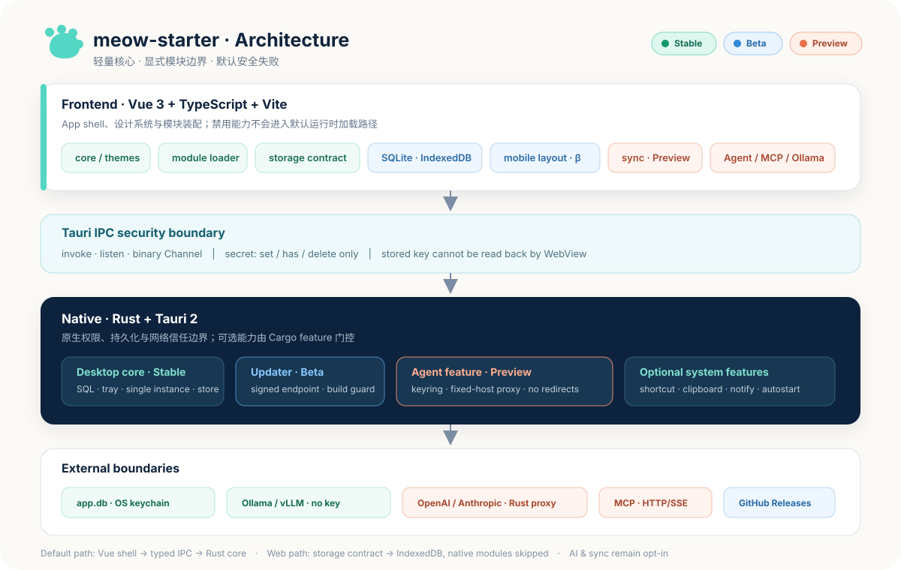

# 📚 文档中心

欢迎来到 MeowStarter 与拾学的文档中心。拾学是本地优先的通用待办与时间规划应用，学习模式可选；按你的角色或目标选择入口：

## 成熟度速览

| 级别 | 能力 |
| --- | --- |
| **Stable** | core、SQLite、主题、桌面托盘/单实例 |
| **Beta** | 拾学通用任务与时间规划源码、Web IndexedDB、updater 构建链路、移动端响应式与桌面能力降级 |
| **Preview** | Sync、Agent、Ollama、MCP、可选系统插件 |
| **Roadmap** | sidecar、RAG、语音、OCR |

专题文档既包含当前用法，也包含目标设计；每篇开头的成熟度说明优先于路线图描述。拾学桌面导航有七个一级入口，紧凑布局有五个底栏入口；Web smoke 与窄屏截图不构成原生验收。v0.3.0 无签名本地候选已通过自动 package smoke 和已安装应用验收；它尚未发布，MSI 安装、退出后不再投递、系统 200% 缩放、Narrator、Authenticode、已发布版本 updater 端到端升级，以及 iOS/iPadOS/Android 原生验收仍为 `NOT_RUN` 或 `BLOCKED`，详见[验收账本](./releases/v0.3.0-acceptance.md)。

## 按目标导航

| 我想… | 文档 |
| --- | --- |
| 快速了解项目定位与适配场景 | [project-guide.md](./project-guide.md) |
| 配置本地开发与 exFAT 工作区 | [development.md](./development.md) |
| 定义产品目标、数据与交付边界 | [application-protocol.md](./application-protocol.md) |
| 查看拾学与 Todofy 的源码级功能对标 | [todofy-benchmark.md](./todofy-benchmark.md) |
| 了解拾学已锁定的时间规划范围与验收边界 | [时间规划总规格](./superpowers/specs/2026-09-04-shixue-time-planning-foundation.md) · [集成与发布计划](./superpowers/plans/2026-09-04-navigation-integration-release.md) · [视觉合同](../DESIGN.md) · [视觉验收](../VISUAL_QA.md) |
| 了解 Release Kit 与发布边界 | [release-kit.md](./release-kit.md) |
| 下载 Windows 免安装版、了解 Authenticode | [windows-distribution.md](./windows-distribution.md) |
| 复盘 Windows v0.2.3 发布事故与门禁 | [windows-v0.2.3-release-retrospective.md](./windows-v0.2.3-release-retrospective.md) |
| 从模板做出第一个应用 | [blueprints/README.md](./blueprints/README.md) |
| 用设计系统、写组件、加主题 | [design-system.md](./design-system.md) |
| 理解模块化架构、扩展模块 | [modular-architecture.md](./modular-architecture.md) |
| 了解全部 AI Native 能力规划 | [ai-capabilities.md](./ai-capabilities.md) |
| 接入 Agent（对话/工具/记忆） | [agent-integration.md](./agent-integration.md) |
| 接本地模型（Ollama） | [local-inference.md](./local-inference.md) |
| 接 MCP 外部工具 | [mcp.md](./mcp.md) |
| 运行和部署 Web 版 | [web.md](./web.md) |
| 接账号、云端或局域网同步 | [sync.md](./sync.md) |
| 移动端适配（Android/iOS） | [mobile.md](./mobile.md) |
| 维护开源社区与推广节奏 | [community-growth.md](./community-growth.md) |

## 按角色导航

- **新用户 / 决策者** → 先读 [project-guide.md](./project-guide.md)，判断项目是否适合
- **贡献者 / Agent** → 先读 [development.md](./development.md)，再遵守 [../AGENTS.md](../AGENTS.md)
- **发布负责人** → 先读 [release-kit.md](./release-kit.md)，再用 [Windows v0.2.3 交付复盘](./windows-v0.2.3-release-retrospective.md) 检查已知失败模式
- **准备做首个应用的开发者** → 先读 [blueprints/README.md](./blueprints/README.md)，按产品类型选择一条窄路径
- **前端开发者** → 先读 [design-system.md](./design-system.md)，再动手写组件
- **架构师 / 进阶开发者** → 先读 [modular-architecture.md](./modular-architecture.md) 与 [agent-integration.md](./agent-integration.md)
- **AI 应用开发者** → 按需读 [agent-integration.md](./agent-integration.md)、[local-inference.md](./local-inference.md)、[mcp.md](./mcp.md)
- **多端开发者** → 读 [web.md](./web.md) 与 [mobile.md](./mobile.md) 了解各平台适配与降级策略
- **本地优先应用开发者** → 读 [sync.md](./sync.md) 选择账号、云端或 LAN 接入层

## 文档清单

| 文档 | 一句话说明 |
| --- | --- |
| project-guide.md | 项目适配指南：适合做什么 + 分类型注意事项 |
| development.md | 本地开发：环境诊断、验证命令与 exFAT 处理 |
| application-protocol.md | 应用协议：产品意图、能力、数据、降级与证据边界 |
| todofy-benchmark.md | Todofy 固定提交的源码审计、功能取舍、落地模块与验收点 |
| superpowers/specs/2026-09-04-shixue-time-planning-foundation.md | 通用任务、可选学习、Today / 最近 7 天、重复、离线 NLP、多提醒/托盘和四种日历视图的总规格 |
| superpowers/plans/2026-09-04-navigation-integration-release.md | 七入口桌面导航、五入口紧凑导航、文档与 Windows 安装包验收计划 |
| ../DESIGN.md / ../VISUAL_QA.md | 用户批准的 `LOCKED / NAVIGATION AMENDED` 视觉合同、统一控件规则与固定视口验收矩阵 |
| release-kit.md | Release Kit：配置检查与发布成熟度边界 |
| windows-distribution.md | Windows 免安装交付、SmartScreen 与 Authenticode 选择指南 |
| windows-v0.2.3-release-retrospective.md | v0.2.3 Windows 交付事故、证据边界与防复发清单 |
| blueprints/ | 首个应用蓝图：本地笔记、开发者工具、本地 AI 伴侣 |
| design-system.md | 设计系统：tokens + 组件 + 主题 + 性能 + 可达性 |
| modular-architecture.md | 模块化架构：运行时与原生构建双平面契约 + 平台能力 |
| ai-capabilities.md | AI Native 能力清单：P1-P3 落地节奏 |
| agent-integration.md | Agent 集成方案：框架对比 + 双轨设计 + 分阶段路径 |
| local-inference.md | 本地推理：Ollama 接入 + 密钥安全 |
| mcp.md | MCP 接入：连接外部工具到 Agent |
| mobile.md | 移动端适配（Android/iOS）：前置依赖 + 初始化 + 降级 |
| web.md | Web 适配：IndexedDB、版本化 Todo 数据端口、平台能力与静态部署 |
| sync.md | 同步接缝：outbox + HTTP + 云端/LAN/CRDT 方案选择 |
| community-growth.md | 开源曝光、贡献者入口与首月运营节奏 |

## 架构图

## 其他资源

- 主 README：[../README.md](../README.md)（中文）· [../README.en.md](../README.en.md)（English）
- 贡献：[../CONTRIBUTING.md](../CONTRIBUTING.md)
- 行为准则：[../CODE_OF_CONDUCT.md](../CODE_OF_CONDUCT.md)
- 安全：[../SECURITY.md](../SECURITY.md)
- 变更日志：[../CHANGELOG.md](../CHANGELOG.md)
