# Shixue software architecture

[中文](./architecture.md) · [Back to the English README](../README.en.md)

This document describes the implemented architecture and verified boundaries on the current `main`. Solid lines show runtime or data flow. Dashed lines show conditional fallback, independent verification relationships, or limits that automation does not prove. Every diagram is an SVG that can be opened and zoomed; its Mermaid source sits beside it.

## Overview

The platform adapter is selected and registered before Vue mounts. Every live workspace business write passes through `TaskCapabilityService`; UI read-only refresh may call `WorkspaceStore.load()` directly. `WorkspaceStore.save()` accepts an optional `expectedUpdatedAt`, and live writes from the capability service always use CAS.

## Runtime and data architecture

- **Bootstrap and assembly:** Web, Tauri desktop, and Tauri mobile share the Vue application. The Rust native host reports the native target, which the frontend maps into the platform and declared capabilities in `RuntimeInfo`. The module loader assembles only enabled and compatible modules whose dependency order is valid.
- **Application and domain:** A versioned command envelope enters `TaskCapabilityService`, which validates version, idempotency, and workspace revision before routing a domain command. Each transaction clones and strictly validates a `WorkspaceStateV3` snapshot containing tasks, lists, tags, recurrence, reminders, focus sessions, receipts, and events. Today, Upcoming, search, Rhythm, and Weekly Review are derived read-only models.
- **Local persistence:** Web uses IndexedDB at `meow-study · studyState/current`; Tauri desktop/mobile use SQLite at `study.db · study_state(id=1)`. The registry starts with the in-memory implementation. If durable adapter assembly fails, the error is reported and that default remains active for the run; a runtime read/write failure from an already registered database does not switch back to memory automatically.
- **Migration and exchange:** Workspace JSON v3 import is strictly validated. Study v1/v2 is validated, migrated, and then revalidated as v3. Legacy migration and guarded repair preserve and verify the original payload before replacing current state. JSON v3 is a complete workspace backup but excludes device preferences, secrets, and sync sessions; Learning Markdown is a one-way, read-only evidence projection.

## Platform capabilities, verification, and delivery

Platform capability availability also depends on module configuration, platform compatibility, dependency order, compiled Rust bindings, and Tauri permissions. The presence of a plugin or source file alone does not make a capability usable. Sync, Agent, Clipboard, and MCP are disabled by default: Sync remote-state import passes through the capability service, Agent remains planned, and MCP is a separate module that depends on Agent.

The four verification and delivery lanes are independent:

| Lane | What it currently proves | What it does not prove |
| --- | --- | --- |
| Regular CI | Node tests, protocol and module contracts, Web/desktop builds, and Rust fmt/clippy/test/check | A deployed Web build, native-device UX, or an installed update |
| Manual Android | APK identity, Activity, five readiness phases, a stable foreground process, and SQLite recovery after application-process restart in an isolated x86_64 emulator | A physical Android device, emulator reboot, native notifications, signing, or store delivery |
| Local Windows Release Kit | Format, size, SHA-256, and manifest checks for NSIS, MSI, and Portable; the NSIS install/launch/relaunch/uninstall lifecycle | MSI installation, Portable runtime, 200% scaling, Narrator, Authenticode, or installed updater E2E |
| Version-tagged Release | Tag gate, draft assets, Portable digest verification, and publication after checks | The complete install and update experience on an end-user machine |

Current-tree iOS execution, mobile signing and stores, a deployed Web host, macOS/Linux packages, and macOS notarization are also outside the evidence produced by these lanes.

## Complete panorama and editable sources

- [Open the complete scalable panorama SVG](./design/shixue-software-architecture.svg)
- [Edit the complete panorama Mermaid source](./design/shixue-software-architecture.mmd)
- [Edit the README overview source](./design/shixue-architecture-overview.mmd)
- [Edit the runtime and data diagram](./design/shixue-runtime-data-architecture.mmd)
- [Edit the platform and delivery diagram](./design/shixue-platform-delivery-architecture.mmd)

Render with Mermaid CLI `11.17.0`. Commit the SVG with every source change, then run `npm run check:docs` and `npm run verify`.
